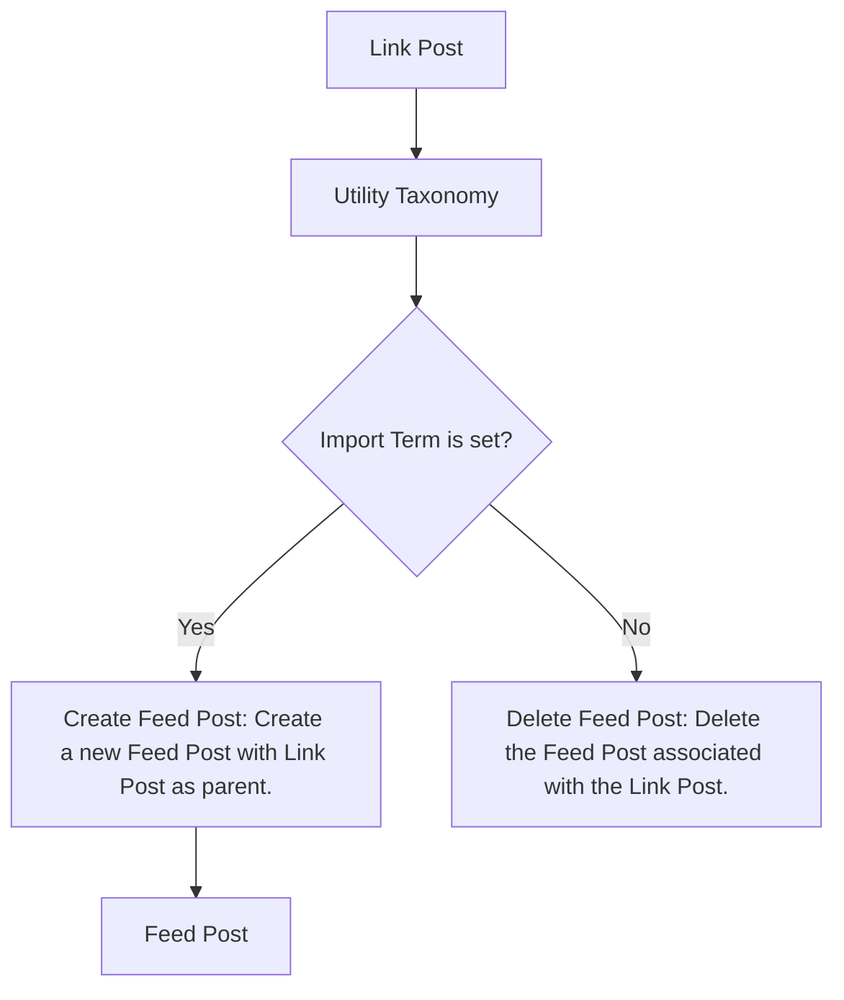
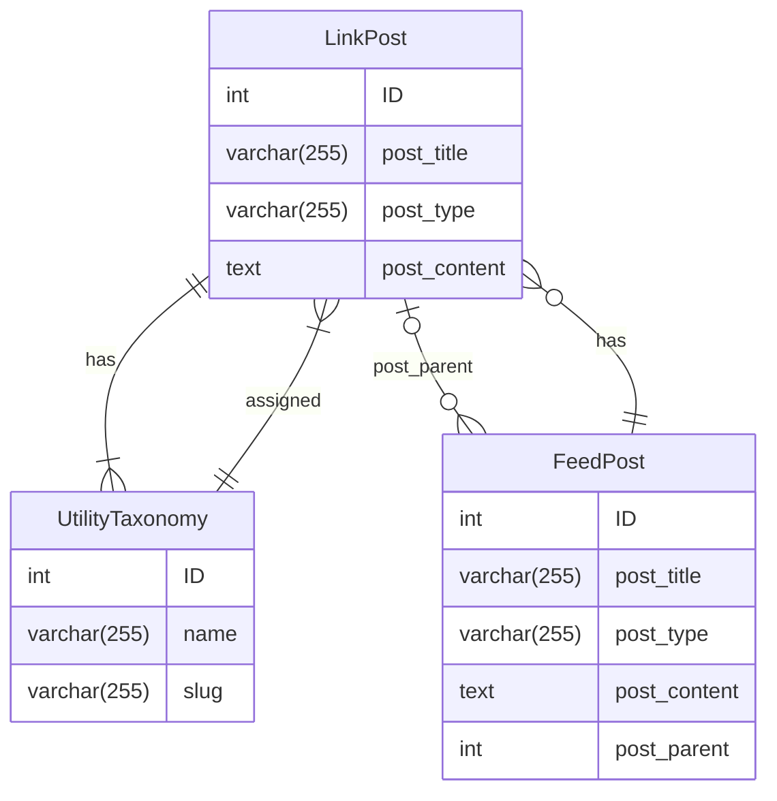

# feed-pull Integration

- Link Post (A): The custom post type for links.
- Utility Taxonomy (B): The custom taxonomy for utilities.
- Import Term is set? (C): A decision point to check if the "import" term is set for the Link Post in the Utility Taxonomy.
- Create Feed Post (D): If the "import" term is set, create a new Feed Post with the Link Post as its parent.
- Feed Post (E): The custom post type for feeds.
- Delete Feed Post (F): If the "import" term is removed, delete the Feed Post associated with the Link Post.

## flow of the processes

From the Link Post, the flow goes to the Utility Taxonomy, which is connected to the decision point of whether the "import" term is set. 

If the "import" term is set, the flow goes to the process of creating a new Feed Post with the Link Post as its parent. 

If the "import" term is not set, the flow goes to the process of deleting the Feed Post associated with the Link Post.

## entity-relationship diagram

- Link Post: The custom post type for links.
- Utility Taxonomy: The custom taxonomy for utilities.
- Feed Post: The custom post type for feeds.
- has: A relationship between Link Post and Utility Taxonomy, indicating that Link Posts can have terms assigned from the Utility Taxonomy.
- assigned: A relationship between Utility Taxonomy and Link Post, indicating that terms from the Utility Taxonomy can be assigned to Link Posts.
- has: A relationship between Feed Post and Link Post, indicating that Feed Posts can have Link Posts as their parent.

The rectangles represent entities, and the diamond shapes represent relationships between entities. The arrows indicate the direction of the relationships. The text inside each entity and relationship represents the attributes and descriptions of each element.

This diagram shows how the Link Post and Feed Post entities are related through a parent-child relationship, with terms from the Utility Taxonomy being used to assign feeds to specific Link Posts.

